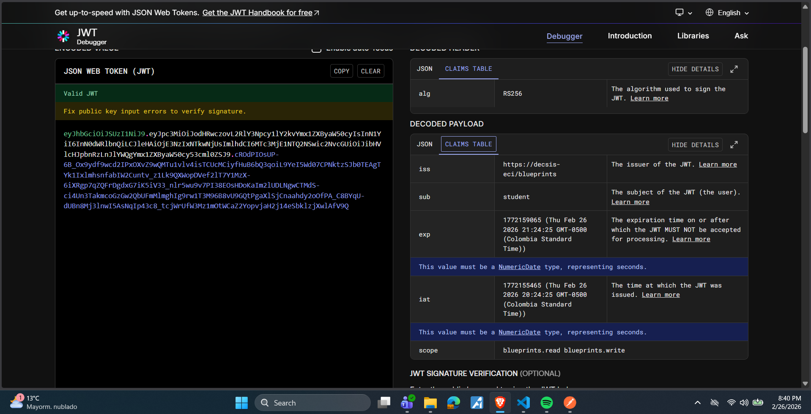
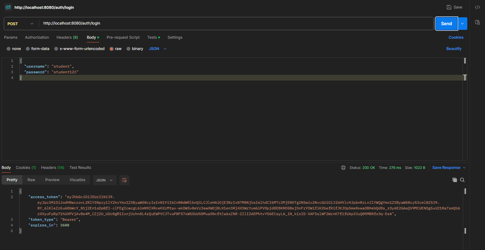
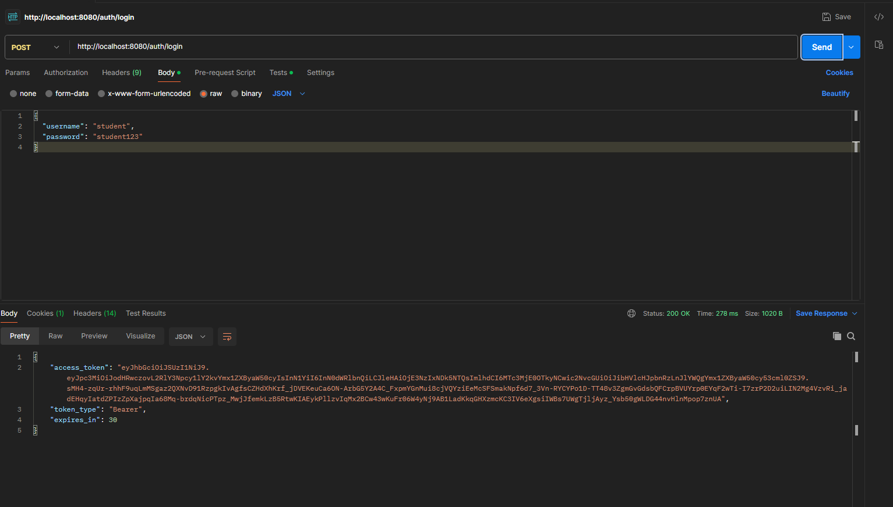
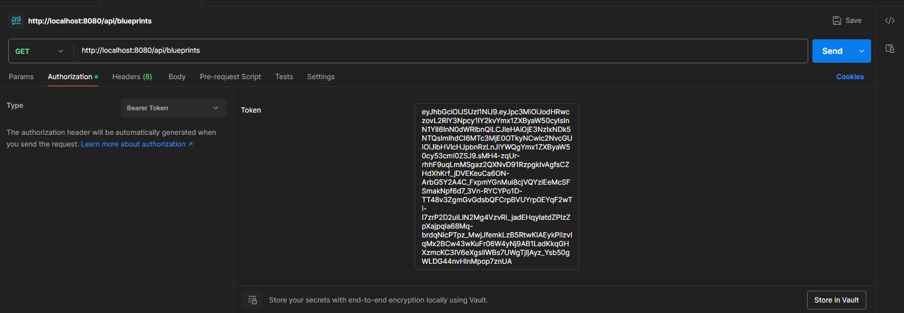
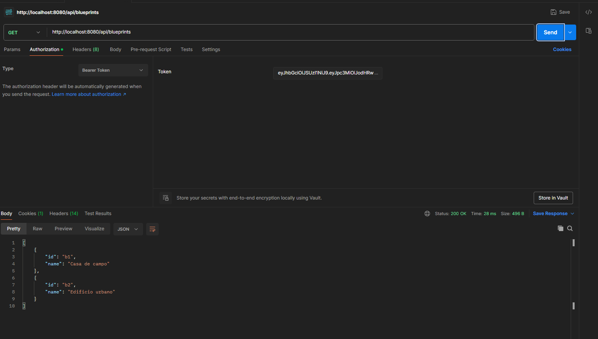
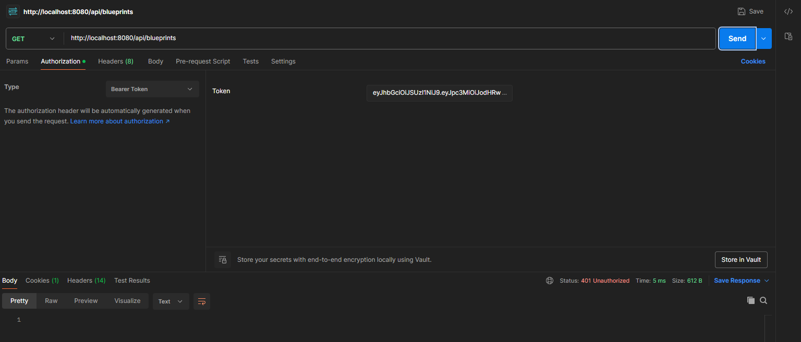
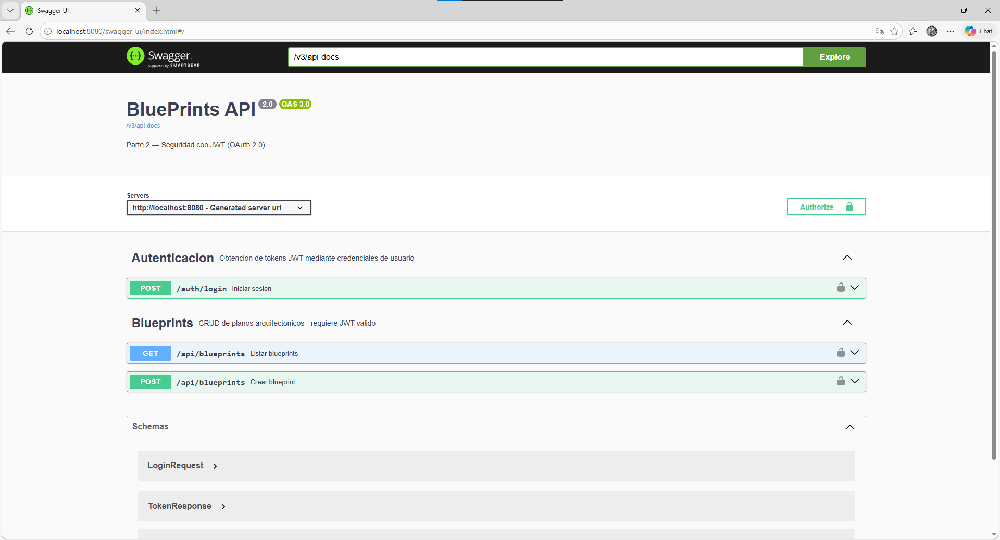
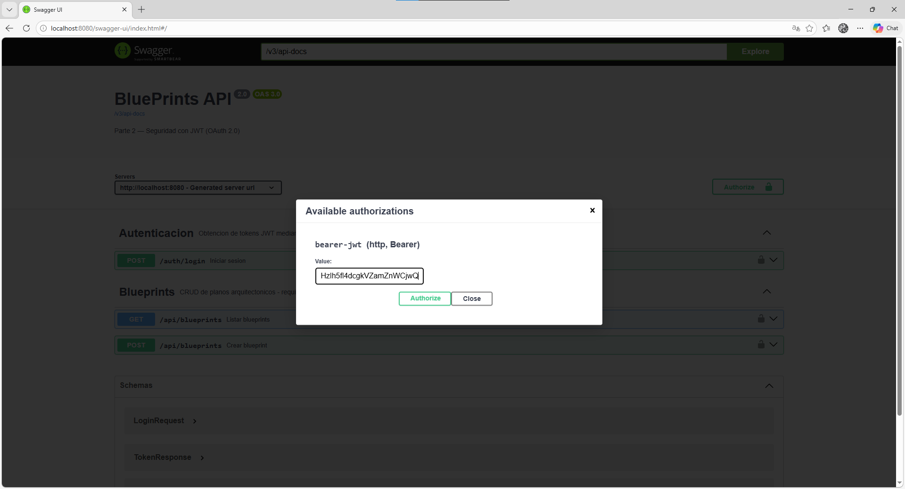
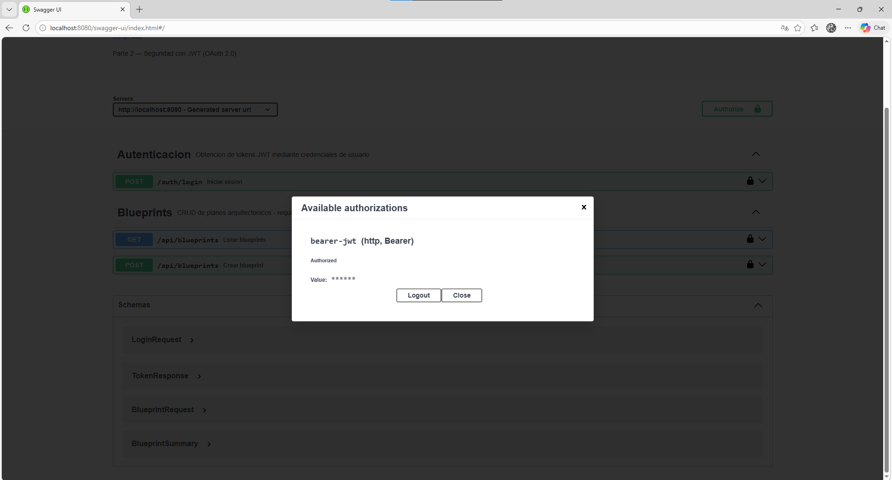

# Escuela Colombiana de Ingeniería Julio Garavito
## Arquitectura de Software – ARSW
### Yojhan Toro - Ivan Cubillos

### Laboratorio – Parte 2: BluePrints API con Seguridad JWT (OAuth 2.0)

Este laboratorio extiende la **Parte 1** ([Lab_P1_BluePrints_Java21_API](https://github.com/DECSIS-ECI/Lab_P1_BluePrints_Java21_API)) agregando **seguridad a la API** usando **Spring Boot 3, Java 21 y JWT (OAuth 2.0)**.  
El API se convierte en un **Resource Server** protegido por tokens Bearer firmados con **RS256**.  
Incluye un endpoint didáctico `/auth/login` que emite el token para facilitar las pruebas.

---

## Objetivos
- Implementar seguridad en servicios REST usando **OAuth2 Resource Server**.
- Configurar emisión y validación de **JWT**.
- Proteger endpoints con **roles y scopes** (`blueprints.read`, `blueprints.write`).
- Integrar la documentación de seguridad en **Swagger/OpenAPI**.

---

## Requisitos
- JDK 21
- Maven 3.9+
- Git

---

## Ejecución del proyecto
1. Clonar o descomprimir el proyecto:
   ```bash
   git clone https://github.com/DECSIS-ECI/Lab_P2_BluePrints_Java21_API_Security_JWT.git
   cd Lab_P2_BluePrints_Java21_API_Security_JWT
   ```
   ó si el profesor entrega el `.zip`, descomprimirlo y entrar en la carpeta.

2. Ejecutar con Maven:
   ```bash
   mvn -q -DskipTests spring-boot:run
   ```

3. Verificar que la aplicación levante en `http://localhost:8080`.

---

## Endpoints principales

### 1. Login (emite token)
```
POST http://localhost:8080/auth/login
Content-Type: application/json

{
  "username": "student",
  "password": "student123"
}
```
Respuesta:
```json
{
  "access_token": "eyJhbGciOiJSUzI1NiIsInR5cCI6IkpXVCJ9...",
  "token_type": "Bearer",
  "expires_in": 3600
}
```

### 2. Consultar blueprints (requiere scope `blueprints.read`)
```
GET http://localhost:8080/api/blueprints
Authorization: Bearer <ACCESS_TOKEN>
```

### 3. Crear blueprint (requiere scope `blueprints.write`)
```
POST http://localhost:8080/api/blueprints
Authorization: Bearer <ACCESS_TOKEN>
Content-Type: application/json

{
  "name": "Nuevo Plano"
}
```

---

## Swagger UI
- URL: [http://localhost:8080/swagger-ui/index.html](http://localhost:8080/swagger-ui/index.html)
- Pulsa **Authorize**, ingresa el token en el formato:
  ```
  Bearer eyJhbGciOi...
  ```

---

## Estructura del proyecto
```
src/main/java/co/edu/eci/blueprints/
  ├── api/BlueprintController.java       # Endpoints protegidos
  ├── auth/AuthController.java           # Login didáctico para emitir tokens
  ├── config/OpenApiConfig.java          # Configuración Swagger + JWT
  └── security/
       ├── SecurityConfig.java
       ├── MethodSecurityConfig.java
       ├── JwtKeyProvider.java
       ├── InMemoryUserService.java
       └── RsaKeyProperties.java
src/main/resources/
  └── application.yml
```

---

## Actividades propuestas
1. Revisar el código de configuración de seguridad (`SecurityConfig`) e identificar cómo se definen los endpoints públicos y protegidos.
   Los endpoints se diferencian así:
   1. Públicos (sin token):
      - `/auth/login`
      - Endpoints de Swagger
   2. Protegidos:
      - Cualquier ruta `/api/**` requiere el scope `blueprints.read` o `blueprints.write`.
   3. El resto:
      - Requiere estar autenticado mediante JWT.
2. Explorar el flujo de login y analizar las claims del JWT emitido.
   1. Se hace `POST` a `/auth/login` con `username` y `password`.
   2. `InMemoryUserService` valida las credenciales contra los usuarios en memoria:
      - `student / student123`
      - `assistant / assistant123`
   Si son válidas, `AuthController` genera un JWT firmado con RSA256 que contiene estas claims:
   - `iss` = issuer (definido en properties)
   - `iat` = fecha de emisión
   - `exp` = fecha de expiración
   - `sub` = username
   - `scope` = `"blueprints.read blueprints.write"`
   Al usar la herramienta jwt.io podemos verificar esta información como se ve en la siguiente imagen:
   

3. Extender los scopes (`blueprints.read`, `blueprints.write`) para controlar otros endpoints de la API del laboratorio P1.
   Se modifica `SecurityConfig`. Se ajusta la generación del token en `AuthController`.
4. Modificar el tiempo de expiración del token y observar el efecto.
   Para controlar cuánto dura el token JWT solo se cambió la propiedad `token-ttl-seconds` en el `application.yml`, ese valor lo lee `RsaKeyProperties` cuando arranca la app y luego llega al `AuthController`, donde se usa en `now.plusSeconds(ttl)` para definir el `exp` del token, cuando lo bajé a 30 segundos el token generado en `/auth/login` dejaba de funcionar en menos de un minuto, y cualquier petición a `/api/blueprints` respondía con 401 y el mensaje *"Jwt expired"*

    El tiempo por defecto estaba en una hora, como se muestra en la siguiente imagen:
   

    Luego cuando cambiamos el tiempo a 30 segundos la peticion se ve como:
   

    Utilizamos el token en una consulta para verificar su funcionamiento:
   
   

    Y esperamos 30 segundos para ver si el token expira correctamente:
   

5. Documentar en Swagger los endpoints de autenticación y de negocio.

   Para documentar los endpoints se usaron las anotaciones de SpringDoc OpenAPI directamente en los controladores, en el AuthController se agregó @Tag para que aparezca en la sección Autenticacion en Swagger, y @Operation para explicar qué hace el login, los usuarios de prueba y la nota del TTL configurable, también se anotaron los records LoginRequest y TokenResponse con @Schema para que Swagger muestre la descripción y ejemplos de cada campo, en el BlueprintController se hizo lo mismo, agregando @Tag, @Operation y @ApiResponses en los métodos GET y POST, incluyendo los códigos 200, 401 y 403 con ejemplos en JSON, además se puso @SecurityRequirement(name = "bearer-jwt") a nivel de clase para que salga el candado en los endpoints y se pueda meter el token desde el botón Authorize en http://localhost:8080/swagger-ui.html

   
   
   

---

## Lecturas recomendadas
- [Spring Security Reference – OAuth2 Resource Server](https://docs.spring.io/spring-security/reference/servlet/oauth2/resource-server/index.html)
- [Spring Boot – Securing Web Applications](https://spring.io/guides/gs/securing-web/)
- [JSON Web Tokens – jwt.io](https://jwt.io/introduction)

---

## Licencia
Proyecto educativo con fines académicos – Escuela Colombiana de Ingeniería Julio Garavito.
